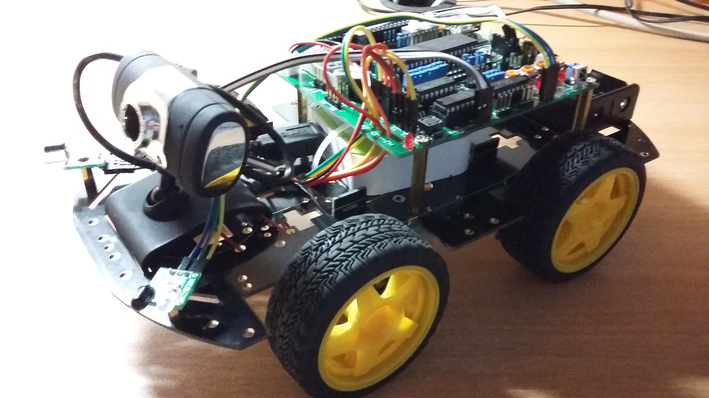

# RobotCar
The Realization of Wireless Control of Robot Car - The Lower Computer Section

This project realizes controlling the robot car by remote operation on Android phones, which ties the upper computer software, the video transmission module of WiFi, the lower computer together. 

## Hardware
- main control board: HJ-4WD. It's the expansion of MCU development board, whose core chip is STC89C52.

- motor driving module: anti-jamming motor with carbon brushes

- infrared avoiding obstacles module

## Program
The goal of the program of lower computer section is that the robot car would be controlled by upper computer section. Here I would show the logic of the program.

### The Logic of Lower Computer
This program would let robot car receive the signal from WiFi transmission module so that the car would move based on the upper computer's command.

### The Logic of avoiding obstacles module
This program is designed based on the chip of motor driving module, L293D.

## Test the robot car
1. Run the program of WiFi remote control on Keil uVision and get .hex file
2. Connect main control board to PC.
3. Open STC-ISP (V6.85H), set all of configurations, find the .hex on the step 1. Then, download MCU program to the robot car.
4. switch on the robot car, open the WiFi on my Android phone and connect to the car.
5. open the car.apk on the phone then I can see the 'car's vision' by the camera on the car and control this car to move.
6. To test the avoiding obstacles module, download its program to the car and let it move in the dim environment towards a wall. 
